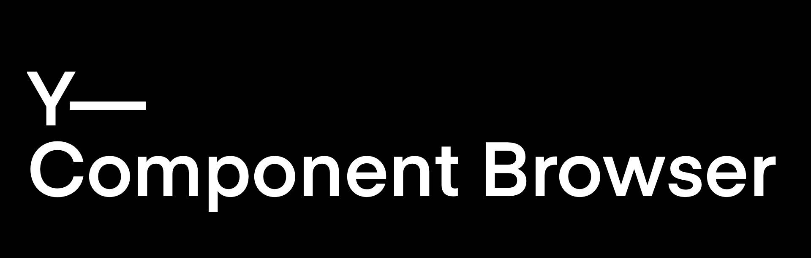

A standalone component browser package that intelligently displays design components.


## Table of Contents
* [Usage](#usage)
     * [Icon Category](#icon-category)
     * [Font Category](#font-category)
     * [Color Category](#color-category)
     * [Catalog Category](#catalog-category)
     * [Custom Component Category](#custom-component-category)
     * [Custom View Controller Category](#custom-view-controller-category)
* [Contributing to Y—Component-Browser](#contributing-to-Y—Component-Browser)
     * [Versioning Stratergy](#versioning-strategy)
     * [Branching Stratergy](#branching-strategy)
     * [Branching Naming Conventions](#branch-naming-conventions)
     * [Pull Requests](#pull-requests)
     * [Releasing New Versions](#releasing-new-versions)
* [Requirements](#requirements)
     * [Jazzy(documentation)](#jazzy-documentation)
* [Setup](#setup)
* [Generating Documentation (via Jazzy)](#generating-documentation-via-jazzy)


Usage
----------
The category is a collection of components utilized in a project that share common traits. A category with a number of subcategories can be created. By default, components are laid out in nested table views, with each component being represented by a single row. A CatalogDisplayView is used to display a component in a single row. It displays small components together with a title and optional subtitle text. This is used for icons, fonts, and colors, but also works well for smaller components such as buttons. It uses generics to display any view (together with an associated model). The framework includes some pre-defined categories for displaying common tasks: icons, colors, and fonts.

The catalog display view model has four parameters:
* The title of the component
* The model of the component
* The description, an optional argument, is nil by default but allows the user to provide more information about the component if necessary.
* A user may choose whether they want the title, description, and components to be shown vertically or horizontally using the axis attribute, which is an optional parameter and is horizontal by default.

Using the custom category defined in the package, a bigger component, such as a card view, can be shown. These custom component may take up a full row by itself. For a components like a view controller, we may skip the table view controller and show the component on the full screen by defining a custom category and destination that comply with the Classification protocol and Destination protocol, respectively.


### Icon Category
For example, a user can create an icon category as follows:

 ```
 enum IconSample {
    static var media: IconCategory {
        IconCategory(
            name: "Media",
            models: [
                .init(
                    title: "Play",
                    model: UIImage(systemName: "play.fill") ?? UIImage()
                )
            ]
        )
    }
}

 ```               
where the user needs to provide the following parameters:
* The name of the category.
* Model for the image to be displayed
     


  
 ### Font Category    
 a user can create a font category as follows:
 ```
enum FontSample {
    static var tiemposHeadlineBold: FontCategory {
        FontCategory(
            name: "TiemposHeadline Bold",
            models: [
                .init(
                    title: "Title 1",
                    model: FontView.Model(
                        font: UIFont(name: "TiemposHeadline-Bold", size: 36) ?? UIFont()
                    )
                )
            ]
        )
    }
}

``` 
where the user needs to provide the following parameters:
* The name of the category.
* Model for the font to be displayed
  
 
  
  
 ### Color category
 a user can create a color category as follows:
 ```
enum ColorSample {
    static var category: ColorCategory {
        ColorCategory(
            name: "Easter",
            models: [
                .init(
                    title: "Purple",
                    detail: "HEX: #D9D7F1",
                    model: UIColor(red: 217/255, green: 215/255, blue: 241/255, alpha: 1)
                )
            ]
        )
    }
}

 ```  
where the user needs to provide the following parameters:
* The name of the category.
* Model for the view to be displayed


### Catalog Category
We can create a category which contains other categories.
```
 let foundationalCategory = CatalogCategory(
            name: "Foundational",
            subcategories: [
                ColorSample.category,
                IconSample.category,
                FontSample.category
            ]
        )
  ```
 where the user needs to provide the following parameters:
* The name of the category.
* Array of subcategories.


### Custom Component Category
Suppose a user wants to display a button named DemoButton from their project.
```
enum DemoButtonSample {
    static var demoButtonCategory: CustomCategory<CatalogDisplayView<DemoButton>> {
        CustomCategory<CatalogDisplayView<DemoButton>>(
            name: "Demo Button",
            models: [
                CatalogDisplayView<DemoButton>.Model(
                    title: "Login",
                    model: DemoButtonModel(
                        backgroundColor: .systemBlue,
                        title: "Login",
                        titleColor: .white
                    )
                )
            ]
        )
    }
}
```
 where the user needs to provide the following parameters:
 * name for the category.
 * model needed to initialise the button.
 


 
 ### Custom View Category
 We can display a custom view within the catalog.
 Suppose a user wants to display a custom view named DemoView from their project.
 ```
 enum DemoViewSample {
    static var demoViewCategory: CustomCategory<DemoView> {
        CustomCategory<DemoView>(
            name: "Demo View",
            models: [
                DemoViewModel(
                    title: "Grocery List",
                    description: "1) apples\n 2) sugar\n 3) coffee\n 4)snacks",
                    backgroundColor: .systemYellow
                )
            ]
        )
    }
}
 ```
 where the user needs to provide the following parameters:
 * name for the category.
 * model needed to initialise the custom view.


### Custom View Controller category
We can display view controllers in the catalog
1. First create a custom destination that returns the view controller 
 ```
 struct CarouselDestination: Destination {
    var navigationTitle: String?
    
    var presentationStyle: Presentation = .detail
    
    func getDestinationController() -> UIViewController {
        return CarouselDemoViewController(navigationTitle: navigationTitle ?? "")
    }
    
    init(presentationStyle: Presentation = .detail, navigationTitle: String) {
        self.presentationStyle = presentationStyle
        self.navigationTitle = navigationTitle
    }
}
```
2. Create a custom category for that particular view controller
```
struct CarouselCategory: Classification {
    let name: String
    
    var destination: Destination {
        CarouselDestination(navigationTitle: name)
    }
    
    init(name: String) {
        self.name = name
    }
}
```
 3. Create instance of the category 
 ```
 enum CarouselSample {
    static var category: CarouselCategory {
        CarouselCategory(name: "Carousel Demo View Controller")
    }
}
```


Contributing to Y—Component-Browser
----------

### Versioning strategy

We utilize [semantic versioning](https://semver.org).

```
{major}.{minor}.{patch}
```

e.g.

```
1.0.5
```

### Branching strategy

We utilize a simplified branching strategy for our frameworks.

* main (and development) branch is `main`
* both feature (and bugfix) branches branch off of `main`
* feature (and bugfix) branches are merged back into `main` as they are completed and approved.
* `main` gets tagged with an updated version # for each release
 
### Branch naming conventions:

```
feature/{ticket-number}-{short-description}
bugfix/{ticket-number}-{short-description}
```
e.g.
```
feature/CM-44-button
bugfix/CM-236-textview-color
```

### Pull Requests

Prior to submitting a pull request you should:

1. Compile and ensure there are no warnings and no errors (this includes warnings from SwiftLint).
2. Run all unit tests and confirm that everything passes.
3. Check unit test coverage and confirm that all new / modified code is fully covered.
4. Run `jazzy` from the command line and confirm that you have 100% documentation coverage.
5. Consider using `git rebase -i HEAD~{commit-count}` to squash your last {commit-count} commits together into functional chunks.
6. If HEAD of the parent branch (typically `main`) has been updated since you created your branch, use `git rebase main` to rebase your branch.
    * _Never_ merge the parent branch into your branch.
    * _Always_ rebase your branch off of the parent branch.

When submitting a pull request:

* Use the [provided pull request template](PULL_REQUEST_TEMPLATE.md) and populate the Introduction, Purpose, and Scope fields at a minimum.
* If you're submitting before and after screenshots, movies, or GIF's, enter them in a two-column table so that they can be viewed side-by-side.

When merging a pull request:

* Make sure the branch is rebased (not merged) off of the latest HEAD from the parent branch. This keeps our git history easy to read and understand.
* Make sure the branch is deleted upon merge (should be automatic).

### Releasing new versions
* Tag the corresponding commit with the new version (e.g. `1.0.5`)
* Push the local tag to remote


Requirements
----------

### Jazzy (documentation)
```
sudo gem install jazzy
```

Setup
----------

Open `Package.swift` in Xcode.


Generating Documentation (via Jazzy)
----------

You can generate your own local set of documentation directly from the source code using the following command from Terminal:
```
jazzy
```
This generates a set of documentation under `/docs`. The default configuration is set in the default config file `.jazzy.yaml` file.

To view additional documentation options type:
```
jazzy --help
```
(Once this repo is made public) A GitHub Action automatically runs each time a commit is pushed to `main` that runs Jazzy to generate the documentation for our GitHub page at: https://yml-org.github.io/ycatalogviewer-ios/
